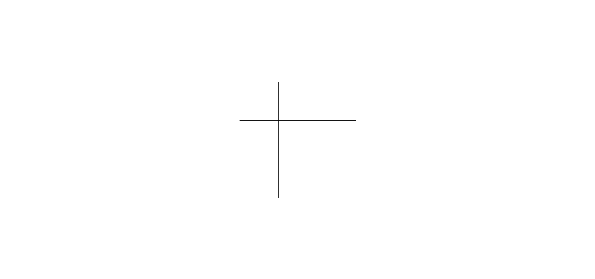
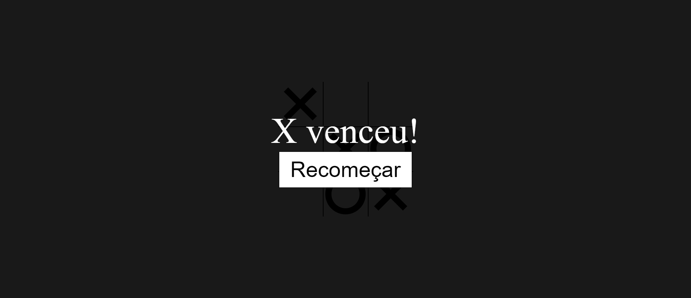

<h1 align="center"> Jogo da Velha </h1>

Jogo da Velha criado utilizando HTML, CSS e JavaScript, com base nos ensinamentos do [vídeo - Build Tic Tac Toe With JavaScript - Tutorial](https://youtu.be/Y-GkMjUZsmM) do canal [@WebDevSimplified](https://www.youtube.com/@WebDevSimplified) no Youtube. 

 

  <a href="#-tecnologias">🚀 Tecnologias</a>&nbsp;&nbsp;&nbsp;|&nbsp;&nbsp;&nbsp;
  <a href="#-projeto">💻 Projeto</a>&nbsp;&nbsp;&nbsp;|&nbsp;&nbsp;&nbsp;
  <a href="#-layout">🔖 Layout</a>&nbsp;&nbsp;&nbsp;|&nbsp;&nbsp;&nbsp;
  <a href="#memo-licença">:memo: Licença</a>

 

  
  

 

## 🚀 Tecnologias

Esse projeto foi desenvolvido com as seguintes tecnologias:

 

## 💻 Projeto

O Jogo da Velha é um jogo para dois jogadores, onde um deles será o "X" e o outro "O", cada jogador na sua vez irá colocar o seu símbolo no tabuleiro, este que possui 9 casas, ganha o primeiro jogador que fizer uma sequência de 3 (três) símbolos. Se nenhum deles conseguir, o jogo termina empatado. Neste projeto foi utilizado apenas HTML, CSS e JavaScript.

 

## 🔖 Layout

Você pode navegar pelo projeto através [DESSE LINK](https://thiagomonts.github.io/jogo-da-velha/).

 

## :memo: Licença

Esse projeto está sob a licença MIT.

 

---

Desenvolvido por [Thiago Honorato](https://www.linkedin.com/in/honoratothiago/)
